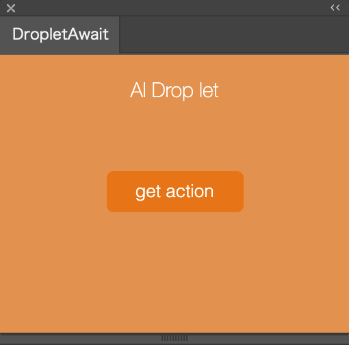
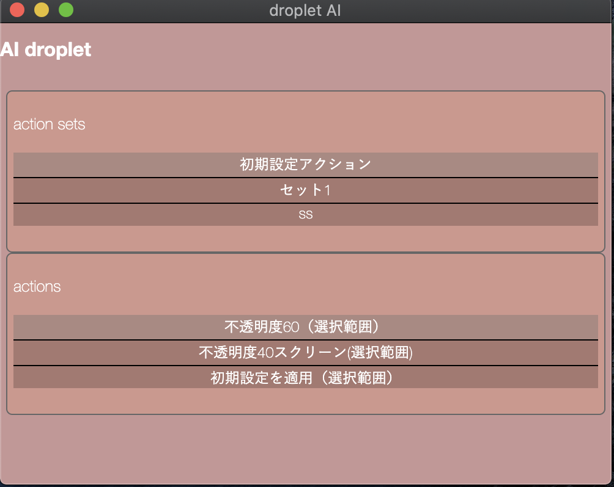

<h1>Illustrator Extension DropletAwait</h1>

    the extension awaits dropped file from electron app AdobeDroplet.
    use this extension with <a href="https://github.com/tokyosheep/AdobeDropLet">adobe droplet</a>.
    both app work like Photoshop droplet.

<h2>how to use it</h2>

    extension awaits file from <a href="https://github.com/tokyosheep/AdobeDropLet">adobe droplet</a>. the electron app
    send files dropped on electron icon. while using Adobe droplet , the app must be opened on Illustrator.

<h2>how to install this</h2>

    you need <a href="Anastasiy’s Extension Manager ">https://install.anastasiy.com/</a>.
    after install it , down load packed extension <a href="">here .</a>
    through the Manager , you can install extension.

